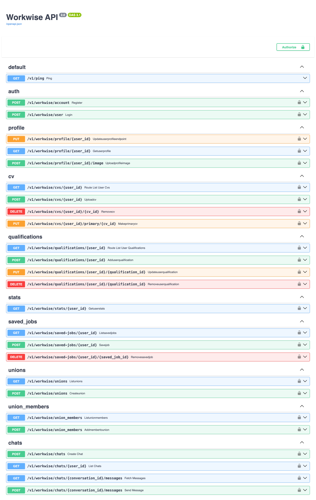

# WorkwiseWeb 🚀

<p align="center">
  
  
  
  
  <a href="LICENSE"></a>
</p>

WorkwiseWeb is the backend API for a professional networking and job-seeking application. Built with FastAPI, it provides a comprehensive set of features for user management, profile customization, job searching, and union membership tracking. The API is designed to be robust and scalable, utilizing a SQLite database for data persistence and Argon2 for secure password hashing.

> 📱 It is the backend for **[Workwise](https://github.com/Nevvyboi/Workwise)**, the native Android
> client. That app talks to every endpoint below.

## 🔌 The API

Eighteen endpoints across auth, profiles, CVs, qualifications, stats, saved jobs, unions and chat,
all documented automatically at `/docs`:

<p align="center"></p>

## Features ✨

*   **🔐 Secure Authentication**: User registration, login, and password reset functionality using email verification codes. Passwords are securely hashed with Argon2.
*   **👤 User Profile Management**: Full CRUD capabilities for user profiles, including personal details, bio, contact information, and location.
*   **📁 File Uploads**: Supports uploading and managing user profile images and CVs (PDF, DOC, DOCX). Files are stored on the server's filesystem.
*   **📄 CV & Qualification Management**: Users can upload multiple CVs, set a primary one, and manage their educational and professional qualifications.
*   **💼 Job & Application Tracking**: View job listings, save interesting jobs, and track statistics like the number of saved jobs and applications.
*   **🤝 Union & Membership Management**: Functionality to create and list trade unions, as well as manage worker memberships within those unions.
*   **🔑 Token-Based API Security**: Endpoints are protected using a static token-based authentication via the `X-Endpoint-Token` header.

## Technology Stack 🛠️

*   **Backend**: Python, FastAPI
*   **Web Server**: Uvicorn
*   **Database**: SQLite
*   **Password Hashing**: Argon2 (`passlib`)
*   **Data Validation**: Pydantic
*   **Dependencies**: `python-multipart`, `jinja2`

## Getting Started 🏁

Follow these instructions to get a local copy up and running for development and testing purposes.

### Prerequisites 📋

*   Python 3.8+
*   A virtual environment tool (e.g., `venv`)

### Installation & Running ⚡

1.  **Clone the repository:**
    ```sh
    git clone https://github.com/nevvyboi/workwiseweb.git
    cd workwiseweb/Src
    ```

2.  **Create and activate a virtual environment:**
    *   On macOS/Linux:
        ```sh
        python3 -m venv venv
        source venv/bin/activate
        ```
    *   On Windows:
        ```sh
        python -m venv venv
        .\venv\Scripts\activate
        ```

3.  **Install the required dependencies:**
    ```sh
    pip install -r requirements.txt
    ```

4.  **Set the endpoint token:**
    Every protected route is guarded by one shared secret, read from the environment. Generate one
    and export it:
    ```sh
    export WORKWISE_ENDPOINT_TOKEN="$(python -c 'import secrets; print(secrets.token_urlsafe(24))')"
    ```
    Leave it unset and the app generates a throwaway token at startup and prints it, so a fresh
    clone runs immediately. That value changes on every restart, so set it properly for anything
    beyond local poking. **No token is stored in this repository.**

5.  **Run the application:**
    ```sh
    uvicorn main:app --reload
    ```
    The API will be available at `http://127.0.0.1:8000`. You can access the interactive API documentation at `http://127.0.0.1:8000/docs`.

## API Usage 🔌

All API endpoints are protected and require an `X-Endpoint-Token` header carrying the value of
`WORKWISE_ENDPOINT_TOKEN`.

### Example: Register a New User 📝

```sh
curl -X POST "http://127.0.0.1:8000/v1/workwise/account" \
-H "Content-Type: application/json" \
-H "X-Endpoint-Token: $WORKWISE_ENDPOINT_TOKEN" \
-d '{
  "username": "newuser",
  "email": "newuser@example.com",
  "password": "a-strong-password"
}'
```

> ⚠️ One shared token is a gate, not authentication. It ships inside the Android client, so treat it
> as a way to keep casual traffic off the API rather than as per user security.

### Main Endpoint Categories 📊

The API is organized into the following categories, visible in the `/docs`:

*   **🔐 auth**: User registration, login, and password management.
*   **👤 profile**: CRUD for user profiles and image uploads.
*   **📄 cv**: CV listing, uploading, and management.
*   **🎓 qualifications**: CRUD for user qualifications.
*   **📈 stats**: User activity statistics.
*   **💼 saved_jobs**: Saving and managing jobs.
*   **🔍 jobs**: Public endpoints for listing and viewing jobs.
*   **🤝 unions**: Creating and listing trade unions.
*   **👥 union\_members**: Managing memberships in unions.

## Database 💾

The application uses SQLite as its database. The database file, `databaseWorkwise.db`, is automatically created in the `Src/` directory upon the first run of the application. The necessary tables are also created and initialized by `Database/db.py`.

The database schema includes tables for:
*   `users` 👥
*   `cvs` 📄
*   `qualifications` 🎓
*   `job_applications` 📋
*   `saved_jobs` 💼
*   `jobs` 🔍
*   `unions` 🤝
*   `union_members` 👥
*   `password_reset_tokens` 🔑

## License 📄

This project is released into the public domain under The Unlicense. See the `LICENSE` file for more details.
